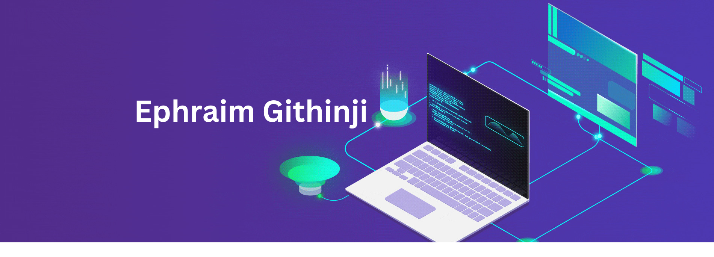

  
  
  
  
  

<h3 align="left">A curious, versatile, passionate Full-Stack Software Developer with a knack for back-end development. </h3>

See [my portfolio website](https://ephygtz.github.io) for more information!

- 🌱 I’m currently learning **Orchestration with; Kubernetes, Jenkins, Terraform and AWS CloudFormation**

<h1 align="center">Projects</h1>
<table bordercolor="#66b2b2">
  <h1 align="center">Working on projects readme file, progress 45%</h1>
  
</table>

<h1 align="center">Technologies</h1>

    
    
    
    
    
    
    
    
    
    
    
    
    
    
    
    
    
    
    
    
    
    
    
    
    

mysql